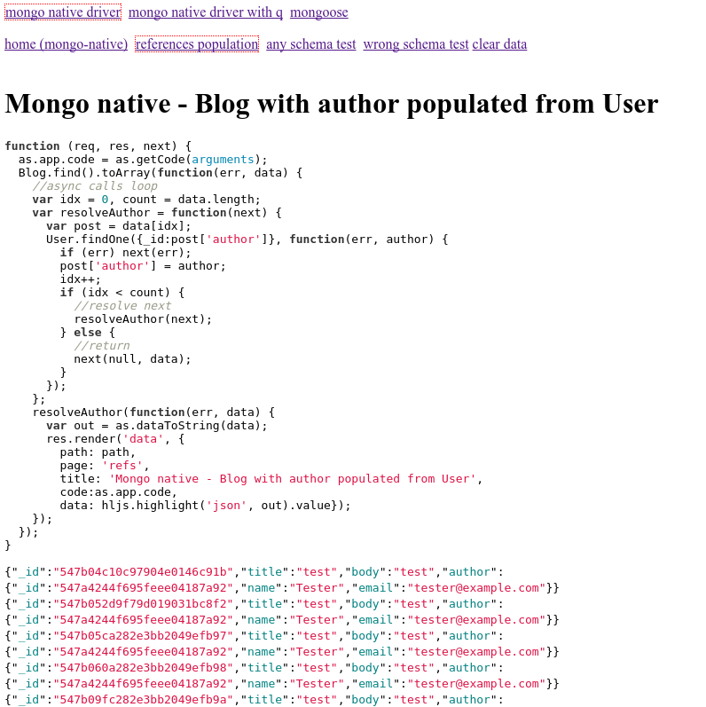

# Testing different MongoDB wrappers.

Install dependencies:

    $ npm install -d

Run example app as:

    $ node app

And open http://localhost:3000/.

The app will display a page with driver selection at the top (native, native with q, mongoose, etc) and few test pages below.
Each page shows test function code and results, like this:



## Mongodb native driver

This is an official [mongodb native node.js driver](http://mongodb.github.io/node-mongodb-native/).

## Mongodb native driver with simple Q wrapper for db and collections

Original native driver code looks like this:

```javascript
var Blog, User, theUser;
//...
db.open(function(err, db) {
  if (err) return next(err);
  db.collection('Blog', function(err, collection) {
    if (err) return next(err);
    Blog = collection;
    db.collection('User', function(err, collection) {
      if (err) return next(err);
      User = collection;
      User.findOne(function(err, usr) {
        if (err) return next(err);
        if (!usr) {
          var newUsr = {name: 'Tester', email: 'tester@example.com'};
          User.insert(newUsr,function(err, newUsr) {
            if (err) return next(err);
            theUser = newUsr;
            next();
          });
        } else {
          theUser = usr;
          next();
        }
      });
    });
  });
});
```

Q wrappers are tiny classes (see mongodb-q.js) which wrap original mongo driver
callback-style methods into Q-style methods.
Code with q wrappers:

```javascript
var Blog, User, theUser;
//...
db.open().then(function(qdb) {
  return qdb.collection('Blog');
}).then(function(collection) {
  Blog = new mq.QCol(collection);
  return db.collection('User')
}).then(function(collection) {
  User = new mq.QCol(collection);
  return User.findOne();
}).then(function(usr) {
  if (!usr) {
    var newUsr = {name: 'Tester', email: 'tester@example.com'};
    User.insert(newUsr).then(function(newUsr) {
      theUser = newUsr;
      next();
    });
  } else {
    theUser = usr;
    next();
  }
}).fail(function(err) {
  return next(err);
});
```

## Mongoose

[Mongoose](http://mongoosejs.com/) seems to be most popular mongodb wrapper.
Features are great:
- Ability to specify [Schema](http://mongoosejs.com/docs/guide.html) to ensure data structure validity
- [Validators](http://mongoosejs.com/docs/validation.html) to verify data itself
- [Populate](http://mongoosejs.com/docs/validation.html) method to fetch related data

Although there are few things which I don't like.

One of the most noticable mongoose features is an ability to specify Schema for
data.
It can look a bit strange - why to add a schema to the schema-less MongoDb?
But actually this can be very useful. In most cases we have some structure for the data and with mongoose we can ensure the data
we save is not some random garbage.
OK, let's try it:

```javascript
var mongoose = require('mongoose')
    , Schema = mongoose.Schema

var userSchema = new Schema({
    name : String
},{strict:'throw'});

var User = mongoose.model('User',userSchema);

mongoose.connect('mongodb://localhost/test',function(err){
    var user = new User({name:'Victor'});
    user.randomGarbage = 'test';
    user.save();
})
```

What's the result? Does it throw the error?
Sadly, the answer is no - our 'randomGrabage' is not saved, but it is silently ignored.
The [answer](https://groups.google.com/forum/#!msg/mongoose-orm/TWA-CLrXGC8/sWd9obdVWPEJ) to that it is just how the mongoose works - it does not see such
a change to the model.
To make it work the 'markModified' call is needed:

```javascript
var user = new User({name:'Victor'});
user.randomGarbage = 'test';
user.markModified('randomGarbage');
user.save();
```

Similar issues are mentioned in docs:
- For arrays you [need](http://mongoosejs.com/docs/faq.html) to "doc.array.set(3, 'val')" instead of "doc.array[3] = 'val'"
- For dates you [also need](http://mongoosejs.com/docs/schematypes.html) to call 'markModified'

Here is [related discussion](https://github.com/LearnBoost/mongoose/issues/1598) on github.
I didn't check how exactly mongoose works, but it sounds a bit strange.
Why it can't just go over object fields to find these changes?

Another (similar in terms of usability) issue is with [instance methods](http://mongoosejs.com/docs/guide.html): "Overwriting a default mongoose document method may lead to unpredictible results".

So while Mongoose's aim seems to provide a more safe and reliable way to work with
MonogoDb it also introduces several ways to silently break the code.
In my opinion such things should not be just described in documentation and treated
as normal situation. The library should handle them and raise explicit errors.
